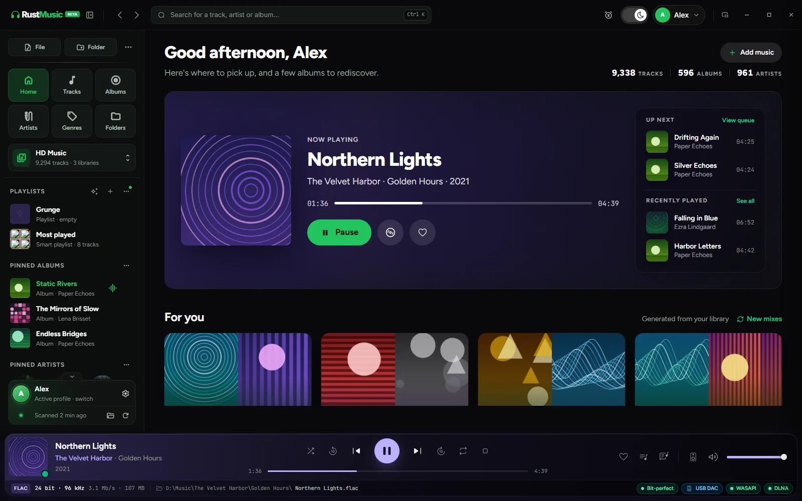
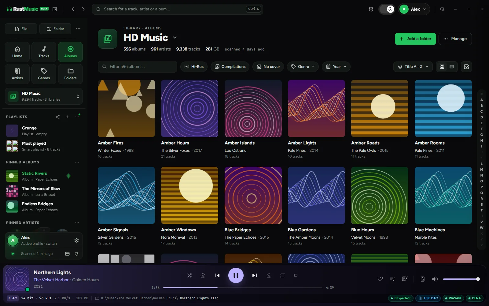
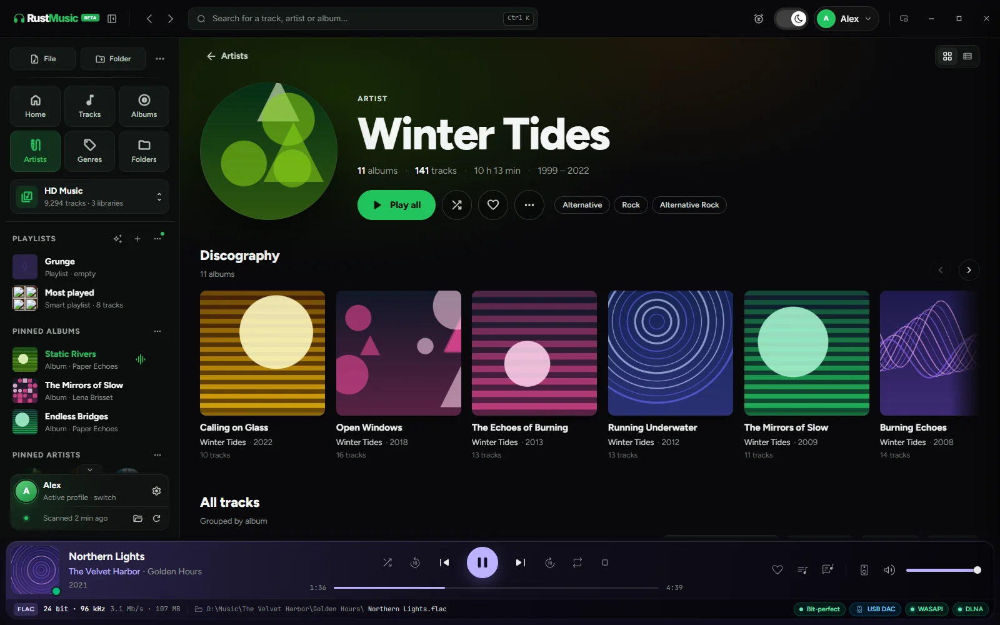
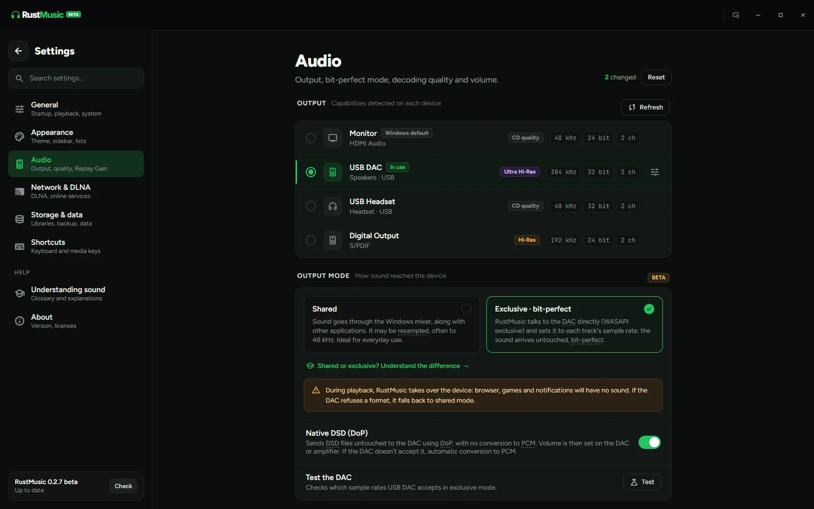
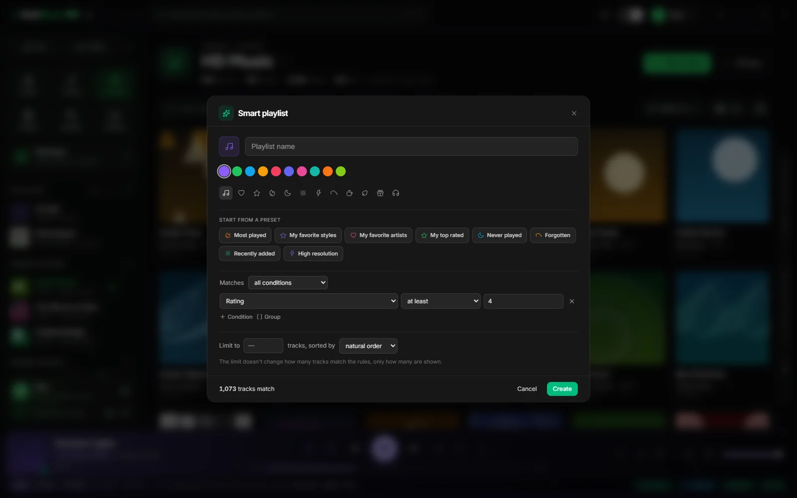

<div align="center">

# RustMusic

**Lecteur de musique Hi-Res gratuit et open source pour Windows, macOS et Linux.**
Lecture bit-perfect, DSD natif, une bibliothèque agréable à parcourir, sans compte, sans pub, sans traqueur.

[](https://rustmusic.dev/downloads)
[](LICENSE)
[](https://rustmusic.dev/downloads)
[](https://rustmusic.dev)

[**Site**](https://rustmusic.dev) · [**Télécharger**](https://rustmusic.dev/downloads) · [**Documentation**](https://rustmusic.dev/docs) · [**Guides**](https://rustmusic.dev/guides) · [**Changelog**](CHANGELOG.md)

🇬🇧 [Read in English](README.md)



</div>

---

## Pourquoi RustMusic

- **Sortie bit-perfect.** Le mode exclusif envoie vos fichiers au DAC sans les modifier, à leur fréquence d’origine : WASAPI exclusif sous Windows, accès direct ALSA sous Linux, « hog mode » CoreAudio sous macOS.
- **DSD natif.** Les fichiers DSF et DFF partent vers votre DAC en DoP, qui les décode en natif, sans conversion en PCM.
- **La même app sur les trois systèmes.** Une interface, une bibliothèque, les mêmes réglages audio sur Windows, macOS (Apple Silicon et Intel) et Linux.
- **Une bibliothèque qu’on a envie de parcourir.** Fiches album et artiste, mix du jour, playlists intelligentes, édition de tags, paroles synchronisées.
- **Respectueux.** Gratuit, GPL-3.0, sans compte, sans pub, sans télémétrie. Il lit vos fichiers, c’est tout.

## Fonctionnalités

### Audio
- Formats : **FLAC, ALAC, WAV, AIFF, MP3, AAC / M4A, OGG Vorbis, Opus, DSF, DFF**
- Mode de sortie **Exclusif · bit-perfect**, avec retour automatique au mode partagé si le DAC refuse un format
- **DSD natif en DoP** (DSD64, DSD128, DSD256 selon votre DAC) ; conversion DSD vers PCM quand le DoP n’est pas pris en charge
- Décodage SACD multicanal, avec un downmix stéréo conforme à l’ITU-R BS.775
- Rééchantillonnage haute précision ([rubato](https://github.com/HEnquist/rubato)) quand la sortie n’accepte pas la fréquence du fichier
- Profils de qualité de décodage : Auto, Maximale, Équilibrée, Compatibilité, Dégradée (pour les machines modestes et les VM)
- Lecture sans blanc (gapless), ReplayGain (par morceau ou par album, avec pré-ampli), reprise de lecture
- Chaîne audio affichée dans le lecteur : format, profondeur, fréquence, pastilles bit-perfect, DSD natif et sortie

### Bibliothèque
- Plusieurs bibliothèques par profil : dossiers locaux, disques externes et NAS (les fichiers réseau sont préchargés pour éviter les coupures)
- Scan incrémental rapide : plusieurs milliers de fichiers en quelques secondes, seuls les fichiers nouveaux ou modifiés au rescan
- Vues Albums, Artistes, Genres, Années, Dossiers et Morceaux, avec filtres, tri et navigation A–Z
- Fiches album (meilleure qualité, disques, label, albums similaires) et artiste (portrait, discographie, « Apparaît sur »)
- Recherche instantanée (Ctrl K), titres likés, récemment joués, albums et artistes épinglés
- Plusieurs profils, chacun avec ses bibliothèques, ses playlists et ses favoris

### Tags, pochettes et paroles
- Édition des tags MP3, FLAC, DSF et DFF : un morceau, par lot, ou dans l’**atelier de tags** façon tableur
- Recherche de métadonnées et de pochettes via l’API publique de Deezer (sans compte)
- Pochettes intégrées, `cover.jpg` / `folder.jpg`, Deezer ou un fichier de votre choix
- Paroles synchronisées depuis un fichier `.lrc` placé à côté du morceau ou depuis [LRCLIB](https://lrclib.net)

### Playlists
- Playlists classiques, et **playlists intelligentes** qui se construisent seules à partir de règles : 24 champs plus n’importe quel tag de vos fichiers, groupes ET/OU imbriqués, limite et tri, avec le nombre de titres recalculé en direct
- 8 recettes toutes faites : mes préférés, oubliés, haute résolution, les plus écoutés, jamais écoutés, ajouts récents, mes artistes favoris, mes styles favoris

### Réseau et système
- **Serveur DLNA / UPnP** intégré : écoutez votre bibliothèque sur un ampli réseau, une TV ou une enceinte connectée, fichiers envoyés intacts
- Contrôles média du système (SMTC sous Windows, Now Playing sous macOS, MPRIS sous Linux) et touches multimédia du clavier
- Mini-lecteur avec file d’attente et paroles synchronisées, minuteur de veille, statistiques d’écoute
- Thèmes sombre, clair et contraste élevé, boutons de fenêtre configurables
- Interface en **français, anglais, espagnol, allemand et italien**
- Mises à jour intégrées et signées

## Captures d’écran

| | |
|:---:|:---:|
|  |  |
| Vue Albums | Fiche artiste |
|  |  |
| Réglages audio : mode exclusif et DSD natif | Éditeur de playlist intelligente |

<sub>Les captures utilisent une bibliothèque de démonstration fictive.</sub>

## Télécharger

Téléchargez la dernière version sur **[rustmusic.dev/downloads](https://rustmusic.dev/downloads)** ou dans les [releases GitHub](https://github.com/larevuegeek/rustmusic-desktop/releases).

| Système | Paquet |
|---|---|
| Windows 10 / 11 (64 bits) | Installeur `.exe` |
| macOS 10.15+ (Apple Silicon et Intel) | `.dmg` universel |
| Linux (64 bits) | `.deb` (Debian, Ubuntu, Mint), `.rpm` (Fedora, openSUSE), `.AppImage` |

Une version de compatibilité glibc 2.35 existe pour les distributions plus anciennes (Ubuntu 22.04, Debian 12).

> Les installeurs ne sont pas signés par un certificat commercial : Windows SmartScreen et macOS Gatekeeper affichent donc un avertissement au premier lancement. Le [guide d’installation](https://rustmusic.dev/docs/installation) explique comment ouvrir l’app. Les mises à jour intégrées, elles, sont signées et vérifiées.

## Compiler depuis les sources

### Prérequis

- [Rust](https://rustup.rs) (stable)
- [Node.js](https://nodejs.org) 20 ou plus récent
- [CMake](https://cmake.org) (pour compiler libopus, utilisé pour l’Opus)

**Linux (Debian / Ubuntu)**

```bash
sudo apt install -y \
  build-essential curl wget file git pkg-config cmake libssl-dev \
  libgtk-3-dev libayatana-appindicator3-dev librsvg2-dev libxdo-dev \
  libwebkit2gtk-4.1-dev libsoup-3.0-dev libjavascriptcoregtk-4.1-dev patchelf \
  libasound2-dev libpulse-dev libdbus-1-dev
```

**macOS**

```bash
xcode-select --install
brew install cmake
```

**Windows**

Installez les [Microsoft C++ Build Tools](https://visualstudio.microsoft.com/visual-cpp-build-tools/) (charge de travail « Développement Desktop en C++ »), [CMake](https://cmake.org/download/) et [WebView2](https://developer.microsoft.com/microsoft-edge/webview2/) (déjà présent sur Windows 10 et 11 à jour).

### Compilation

```bash
git clone https://github.com/larevuegeek/rustmusic-desktop.git
cd rustmusic-desktop
npm install
npm run tauri build
```

Les paquets sont générés dans `src-tauri/target/release/bundle/`.

### Développement

```bash
npm run tauri dev
```

## Architecture

```
rustmusic-desktop/
├── src/                       # Frontend : SvelteKit + TypeScript
│   ├── lib/                   # Composants, stores, services, types, i18n
│   ├── routes/                # Pages SvelteKit
│   └── app.css                # Tailwind 4
├── src-tauri/                 # Backend : Rust + Tauri 2
│   ├── src/
│   │   ├── core/              # Moteur audio (lecteur, décodeurs, rééchantillonnage, DSD, DLNA)
│   │   ├── commands/          # Commandes Tauri exposées au frontend
│   │   ├── repository/        # Couche SQLite (sqlx)
│   │   ├── mapper/            # Correspondance entités ↔ DTO
│   │   └── lib.rs             # Point d’entrée
│   ├── Cargo.toml
│   └── tauri.conf.json
└── CHANGELOG.md
```

**Stack :** SvelteKit et Svelte 5 (runes), TypeScript, Tailwind 4, Vite · Rust, Tauri 2, tokio, axum · CPAL, Symphonia, rubato, décodeur DSD maison · SQLite via sqlx avec migrations versionnées · souvlaki pour les contrôles média du système.

## Contribuer

Les contributions sont les bienvenues. Lisez [CONTRIBUTING.md](CONTRIBUTING.md) pour le style de code, les conventions de commit et le processus de pull request. Pour signaler un bug ou proposer une fonctionnalité, [ouvrez une issue](https://github.com/larevuegeek/rustmusic-desktop/issues) ; pour une faille de sécurité, consultez [SECURITY.md](SECURITY.md).

Si RustMusic vous est utile, une ⭐ sur le dépôt aide d’autres personnes à le découvrir.

## Licence

RustMusic est distribué sous [licence GNU General Public License v3.0](LICENSE).
